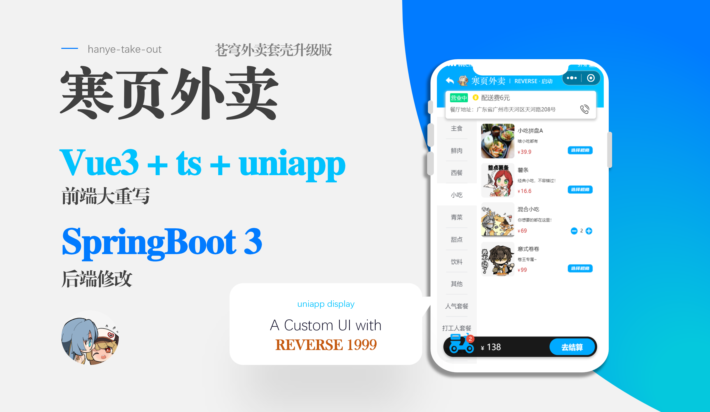

# 寒页外卖（苍穹外卖套壳升级版）

b站项目演示：[寒页外卖](https://www.bilibili.com/video/BV1SM4m1U7eR)




## 一、技术选型

### 前端

`vue3`   `ts`   `uniapp`   `pinia`   `elementPlus`   `ECharts`

nodejs版本： 20.11.1   （最好不要低于16）

### 后端

`springboot3`  `mybatis`  `redis`

版本：JDK17  maven 3.9.6

> 由于我用的是springboot3.2.5，因此JDK版本要17以上才能适配
> 如果用的是 JDK8 或者 11，建议直接看黑马的视频，他们用的是springboot 2.7.3

### 接口文档

使用 `Apifox` 进行管理，相比 `Swagger` 配置更简单；

Apifox = Postman + Swagger + Mock + Jmeter，功能更丰富强大


[官方文档教程]([Apifox IDEA 插件快速上手 | Apifox 帮助文档](https://apifox.com/help/applications-and-plugins/idea/start))

[b站教程](https://www.bilibili.com/video/BV1Jc41147xC)

我利用了 IDEA 里的插件 Apifox Helper

优点是可以通过右键点击 Upload to Apifox 快速生成接口文档

缺点是 如果管理端和用户端的controller相同时，其中的接口会被合到同一级目录中，无法分开，而且我在插件设置里只找到server模块和apifox的项目根目录对应，无法进行细分来分别选择admin user两个模块对应两个接口文档，网上也找不到相关教程，希望有大佬可以帮我解决这个问题。

## 二、使用步骤

下载完源代码并分别在 vscode 和 IDEA 打开项目

**Java后端**

根据sql文件创建数据库和建表，在 IDEA 中连接数据库

**前端网页**

vue3脚手架可以看vue官网创建，建好脚手架再将我的代码导入工程，相关的npm包需要 npm i 进行安装

终端中运行 `npm run dev` 启动前端网页项目

**微信小程序**

相关的npm包需要 `npm i` 进行安装

需要在微信开发者工具中导入 `hanye-take-out-uniapp/dist/mp-weixin` 这部分内容

要编译的话需要 `npm run dev:mp-weixin`，之后修改uniapp的内容时，微信开发者工具里编译好的内容也会相应作出修改

**其他**

其他后端配置基本和苍穹外卖差不多，大家可以参照黑马的教程

后续的代码可能会修改，若大家对项目有疑问的话，我会在 README 文档继续补充


## 三、前端代码说明

### vue3网页代码结构

```
├── .vscode              编辑器配置文件 
├── node_modules         相关包
├── public
│   └── logo.ico:        页签图标
├── src
│   ├── api:             请求接口
│   ├── assets:          存放静态资源
│   │── components:      存放普通组件
|   |── store:           pinia持久化存储
|   |── types:           ts类型校验，相关类型定义
|   |── utils:           工具，如request.ts
│   │── views:           存放页面组件
|   │   |── layout:      布局文件
│   │   │── page1:       分页面1
│   │   │   │── components: 分页面组件
│   │   │   │   └── component1: 分页面组件1
│   │   │   └── index.vue: 分页面
│   │   │── ... :        其他分页面
│   │── App.vue:         汇总所有组件（一般里面放layout就行）
│   │── main.ts:         入口文件，注册elementPlus、pinia等等
│   │── router.ts:       路由
├── .eslintrc.rjs:       语法检查配置
├── .gitignore:          git版本管制忽略的配置
├── .prettierrc.json:    代码格式化相关配置
├── env.d.ts:            开发环境的配置
├── index.html:          主页面
├── package.json:        应用包配置文件 
├── package-lock.json：  包版本控制文件
├── README.md:           应用描述文件
├── tsconfig.xxx.json:   ts的相关配置文件
├── vite.config.ts:      vite配置文件，可在里面配置代理 5173->8080
├── vitest.config.ts:    vitest配置文件
```


### uniapp小程序代码结构

```
├── .husky                管理git钩子
├── dist                  打包编译好的微信小程序项目
├── node_modules          相关包
├── src
│   ├── api:              请求接口
│   │── components:       存放普通组件
│   │── pages:            存放页面组件
|   │   |── layout:       布局文件
│   │   │── page1:        分页面1
│   │   │   │── components: 分页面组件
│   │   │   │   └── component1: 分页面组件1
│   │   │   └── index.vue: 分页面
│   │   │── index:        tab1 首页
│   │   │── my:           tab2 个人中心页
│   │   │── order:        点餐页（左侧分类，右侧菜品列表）
│   │   │── submit:       准备支付页（选择地址、餐具，展示订单信息那一页）
│   │   │── ... :         其他分页面
│   ├── static:           存放静态资源
|   |── stores:           pinia持久化存储
|   |── types:            ts类型校验，相关类型定义
|   |── utils:            工具，如http.ts
│   │── App.vue:          汇总所有组件（一般里面放layout就行）
│   ├── env.d.ts:         开发环境的配置
│   │── main.ts:          入口文件，注册pinia等等
│   │── manifest.json:    编译打包配置
│   │── pages.json:       tab页和普通页面注册，类似网页端的路由router.ts
│   ├── shims-uni.d.ts:   为了 ts 做的适配定义文件，使 ts 能理解 vue
│   │── uni.scss:         uniapp相关内置样式
├── .eslintrc.rjs:        语法检查配置
├── .gitignore:           git版本管制忽略的配置
├── index.html:           主页面
├── package-lock.json:    包版本控制文件
├── package.json:         应用包配置文件 
├── shims-uni.d.ts:       为了 ts 做的适配定义文件，使 ts 能理解 vue
├── tsconfig.json:        ts的相关配置文件
├── vite.config.ts:       vite配置文件
```


### 相关代码注意点

#### reactive响应式监听

如果是监听整个 reactive 对象类型的属性，只有进行整个对象替换时，才不需要开启deep深度监听

其它时候，如修改、删除、新增，都需要开启deep深度监听，才能监听数据的变化

如果是监听对象类型属性中的某个属性值，则不需要开启deep深度监听


## 四、后端代码说明

### Jakarta

springboot3 中的某些部分需要用jakarta, 不用javax，如：

```
拦截器、websocket长连接
```

关于servlet的api接口，本身为JavaEE所有，但是SpringBoot3之后换成 Jakarta EE 了
原因是 eclipse 拿到 Oracle 转过来的 Java EE 规范之后，因版权问题不能使用 javax 名称，所以需要重命名

### 管理端员工权限修改

设置超级管理员和普通员工

如果是超级管理员（本项目用的是cyh账号），则有权限进行所有员工的修改和启用禁用操作

如果是普通员工，则只能对自己账号信息进行修改，前端展示时，其他部分的按钮都是禁用状态

### 地址簿功能修改

在修改地址功能调试时，发现前端的省市区数据一直不更新，后来发现是黑马给的update代码并没有这部分数据，所以需要补上

```java
<if test="provinceCode != null">
    province_code = #{provinceCode},
</if>
<if test="provinceName != null">
    province_name = #{provinceName},
</if>
<if test="cityCode != null">
    city_code = #{cityCode},
</if>
<if test="cityName != null">
    city_name = #{cityName},
</if>
<if test="districtCode != null">
    district_code = #{districtCode},
</if>
<if test="districtName != null">
    district_name = #{districtName},
</if>
```

由于校验地址是否超出范围这部分功能需要用到百度地图的服务，并且我弄了很久还是地址解析失败，考虑到这部分功能对后续无影响，因此我先将这部分功能代码注释掉了

### 订单支付功能修改

若有订单待支付时，不能继续下其他单，否则后端把新的用户下单orderid赋给全局变量order，造成后续支付订单时发生错乱

而且如果可以下其他单的话，小程序需要同时开启多个定时器去进行统计，由于我用一个定时器进行各种校验判断已经够繁琐了，折腾了半天，因此我就不考虑这种并发定时器事务的处理了，若用户要下其他单，则进行提示"您有订单未支付，请先处理再来下单"

### 其他琐碎部分记录

websocket没有3.2.5版本，网上也找不到相关教程，只好下回2.7.3的